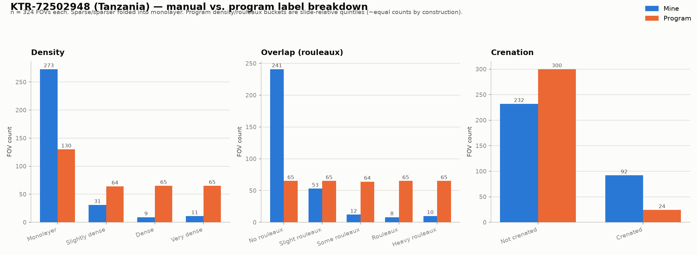
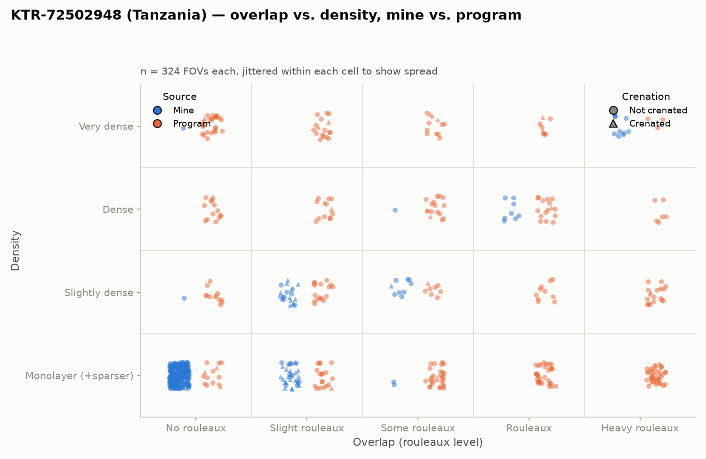

# Tanzania KTR-72502948: manual vs. program label comparison

Dataset: 324 FOVs from slide `KTR-72502948` (Tanzania). Manual labels are
`data/labels/tanzania-073026/KTR-72502948-annotated.csv` (E. Chu, free-text
`tags` column). Program labels are `data/new/KTR-72502948/fov_labels.csv`
(`scripts/label_new_slide.py`, slide-relative quintiles of `coverage_fraction`
and `rouleaux_fraction`). Produced by `scripts/compare_tanzania_labels.py`.

Parsing notes:
- Empty manual tag → minimum value for that axis (no rouleaux tag → "no
  rouleaux"; no "Crenated" tag → not crenated).
- "Sparser" (mine) and "sparse" (program) are folded into "monolayer" on both
  sides, matching the 4-level density scale already used elsewhere in this repo
  (`COL_ORDER` in `build_result_summary.py`).
- Other free-text tags in my labels (Unfocused, Artifact, Other Dimples) aren't
  part of either axis and are ignored.

## Label breakdown

- **Density**: mine is heavily skewed toward monolayer (273/324, 84%). The
  program's labels are roughly flat (130/64/65/65) because its buckets are
  quintiles of this slide's own `coverage_fraction` distribution — by
  construction it always spreads FOVs ~evenly across 4-5 buckets, regardless of
  how uniform the slide actually is.
- **Overlap (rouleaux)**: same pattern, more extreme. Mine: 241/324 (74%) no
  rouleaux, trailing off sharply. The program's crowding buckets are ~65 FOVs
  each across all five levels, again by quintile construction.
- **Crenation**: mine flags 92/324 (28%) as crenated; the program flags
  24/324 (7%).

## Overlap vs. density

My labels (blue) cluster tightly in the monolayer / no-rouleaux corner, with a
sparse trail of denser or more crenated FOVs. The program's labels (orange)
are scattered evenly across all ten cells of the grid — a direct visual
consequence of the quintile bucketing described above.

## Agreement analysis

Exact-match rate and per-axis rank correlation (ordinal index over
`monolayer < slightly dense < dense < very dense` and `no rouleaux < slight <
some < rouleaux < heavy`), same correlation-strength convention as
`data/results/initial-dataset-071626/report.md` (|r| < 0.3 weak, 0.3-0.7
moderate, > 0.7 strong):

| Axis | Exact match | r (ordinal) |
|---|---|---|
| Density | 141/324 (44%) | 0.36 (weak) |
| Rouleaux | 51/324 (16%) | -0.19 (weak / no relationship) |
| Crenation | 212/324 (65%) | — (see confusion below) |

**Density confusion** (rows = mine, cols = program):

| mine \ program | monolayer | slightly dense | dense | very dense |
|---|---|---|---|---|
| monolayer | 126 | 60 | 49 | 38 |
| slightly dense | 3 | 2 | 7 | 19 |
| dense | 1 | 1 | 6 | 1 |
| very dense | 0 | 1 | 3 | 7 |

**Rouleaux confusion** (rows = mine, cols = program):

| mine \ program | no rouleaux | slight | some | rouleaux | heavy |
|---|---|---|---|---|---|
| no rouleaux | 41 | 43 | 57 | 47 | 53 |
| slight rouleaux | 17 | 8 | 3 | 13 | 12 |
| some rouleaux | 2 | 4 | 2 | 4 | 0 |
| rouleaux | 2 | 6 | 0 | 0 | 0 |
| heavy rouleaux | 3 | 4 | 2 | 1 | 0 |

**Crenation confusion**:

| | program: not crenated | program: crenated |
|---|---|---|
| **mine: not crenated** | 210 | 22 |
| **mine: crenated** | 90 | 2 |

## Findings

**Rouleaux label has no relationship with mine (r=-0.19).** Of the 241 FOVs I
called "no rouleaux," the program spreads them almost uniformly across all
five of its own levels (41/43/57/47/53) — the same shape you'd get from random
assignment. `rouleaux_fraction` as currently computed does not appear to track
what I'm calling rouleaux on this slide.

**Density has a weak positive relationship (r=0.36).** Most of the mismatch is
structural rather than a real disagreement: 126 of my 273 monolayer FOVs land
in the program's monolayer bucket (the rest spread across the other three
buckets almost evenly), because the program's quintile scheme *forces* a
roughly-even split even when 84% of the slide is genuinely monolayer by eye.

**Crenation: the program under-detects what I flag, and its few positives
mostly don't overlap with mine.** Of my 92 crenated FOVs, the program agrees
on only 2. It does flag 24 FOVs total, but 22 of those are FOVs I called
*not* crenated — so the flag isn't just conservative, it's picking up a
largely different signal than what I'm calling crenation.

**Takeaway**: because the program's bucketing is quintile-based on this one
slide's own score distribution (see `label_new_slide.py` docstring), it will
always produce a roughly flat label distribution, independent of whether the
slide is actually heterogeneous. On a slide like this one — genuinely skewed
toward monolayer/no-rouleaux/not-crenated by manual read — that scheme
mechanically manufactures disagreement with any skewed manual label set. That
doesn't by itself explain the *rouleaux* axis's near-zero correlation, though;
that mismatch suggests `rouleaux_fraction` isn't capturing the same visual
signal as the manual "rouleaux" tag, independent of the bucketing method.

## Caveats

- Single annotator (E. Chu), single slide — this is a descriptive comparison,
  not a validation study.
- `crenation_flag` never took the `insufficient_data` value on this slide (all
  FOVs had ≥100 isolated cells), so the comparison above only involves
  `flagged` vs `normal`.
- Program thresholds (`label_new_slide.py`) are explicitly slide-relative and
  documented as not intended to generalize to a second slide without
  re-deriving quintiles — so this comparison says more about *this slide's*
  labels than about the program's general accuracy.

## Files

- `scripts/compare_tanzania_labels.py` — generates everything below
- `label-comparison-summary.png`, `overlap-vs-density-scatter.png` — plots
- `merged-labels.csv` — per-FOV mine vs. program table
