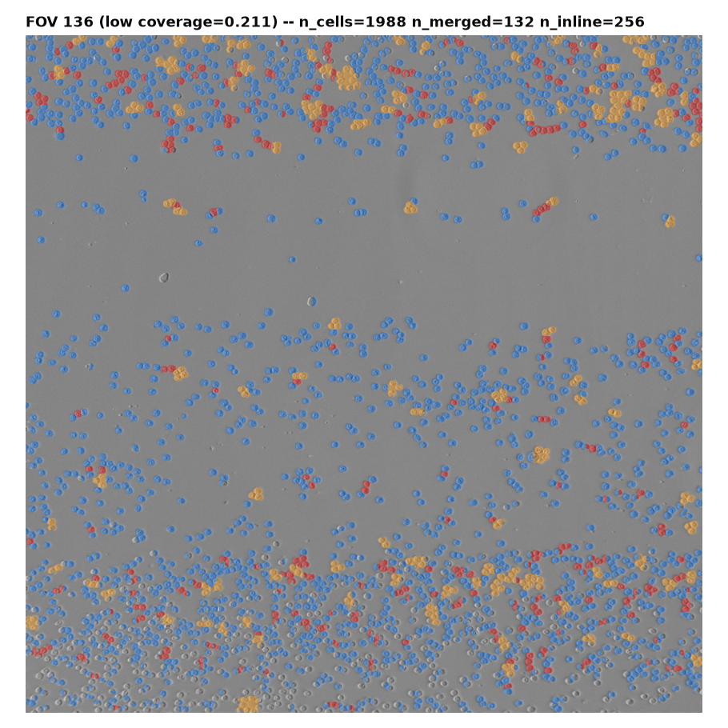

# Why rouleaux_fraction doesn't track manual overlap: a segmentation failure, not a threshold problem

Follow-up to `data/results/tanzania-073026/tanzania-comparison/README.md`, which found
`rouleaux_fraction` (from `scripts/ai-first/score_new_slide.py`) has no positive
relationship with manual overlap labels (marginal rho=-0.19, partial rho=-0.10).
Produced by `scripts/diagnose_rouleaux.py`.

## Method

Ran `score_new_slide.py`'s own `segment()`/`touching_pairs()` code (unmodified) on
4 FOVs manually tagged "heavy rouleaux", each paired with a "no rouleaux" FOV
matched on `coverage_fraction` (so density isn't a confound in the comparison).
Colored every surviving watershed instance by what the algorithm did with it:
blue = ordinary cell, red = flagged "inline" (counts toward `rouleaux_fraction`),
orange = oversized/merged blob (`area > MERGED_AREA_RATIO * reference_area`).

## Finding

At the coverage levels where rouleaux/heavy-rouleaux tags actually occur on this
slide (coverage_fraction 0.55-0.75 — recall density and overlap are correlated,
rho=0.75, so overlap essentially only shows up in the denser FOVs), the
segmentation has already broken down: **15-20% of "cells" are one of a handful
of enormous merged blobs** covering most of the frame (orange dominates every
panel above), not individual cells. The "inline" pairs the algorithm counts as
rouleaux (red) are visibly thin cracks/slivers running between two of these
giant blobs — a watershed boundary artifact that trivially satisfies "exactly 2
neighbors positioned opposite each other," with no relationship to actual
cell-chain morphology.

For contrast, at low coverage (FOV 136, coverage=0.21):

Individual cells are cleanly separated (mostly blue), merged blobs are a small
minority (132/1988 = 6.6%, vs. 15-20% in the crowded pairs above), and the red
"inline" hits are visibly real adjacent-cell pairs, not slivers. The
segmentation works as intended here.

**Quantitative confirmation** (`diagnostic-summary.csv`): every heavy-rouleaux /
no-rouleaux pair, matched on coverage_fraction, has nearly identical
`rouleaux_fraction` — in 2 of 4 pairs the *no-rouleaux* FOV actually scores
higher:

| pair | heavy-rouleaux FOV | rouleaux_fraction | no-rouleaux FOV (matched coverage) | rouleaux_fraction |
|---|---|---|---|---|
| 0 | 205 | 0.119 | 61  | 0.105 |
| 1 | 206 | 0.117 | 242 | **0.127** |
| 2 | 210 | 0.131 | 236 | **0.139** |
| 3 | 215 | 0.118 | 248 | 0.088 |

## Answer to "would tuning `INLINE_COS_THRESHOLD` (or similar) help?"

No. The angle/degree geometry test never gets a fair look at real cell-chain
shapes here, because its input -- the watershed instance labels -- is already
wrong at these coverage levels: most of the true cell boundaries were never
recovered in the first place. Adjusting the -0.7 cosine cutoff, or
`MIN_DISTANCE`, or the merged/fragment area ratios, only reshuffles which
slivers and micro-fragments of the *already-collapsed* segmentation count as
"inline" -- it cannot recover the individual-cell boundaries that watershed
failed to find inside those giant orange blobs. This is a segmentation
capability problem, not a decision-boundary placement problem, and it is
concentrated exactly in the coverage range where overlap/rouleaux occurs on
this slide.

**Implication**: a working overlap/rouleaux measure on this slide needs
either (a) a segmentation step that doesn't collapse under this much crowding
(the current gradient-energy + distance-transform watershed is the bottleneck
-- a trained instance-segmentation model would be the standard fix), or (b) a
feature that doesn't depend on resolving individual cell instances at all --
which is exactly why the four-step pipeline's texture-based features (GLCM
contrast, unmasked edge density) showed a small positive partial correlation
with overlap in `tanzania-comparison/`: they measure local pixel statistics
directly and never need to correctly split touching cells apart.

## Caveats

- 4 pairs, one slide -- illustrative, not exhaustive. But the merged-blob
  fraction and the visual sliver pattern are consistent across all 4 pairs
  and starkly different from the low-coverage control, so this isn't cherry-picked.
- `n_merged` counts instances above `MERGED_AREA_RATIO`, which undercounts the
  true failure -- several of the orange regions above are single watershed
  labels spanning a large fraction of the entire frame, not "slightly
  oversized" cells.
