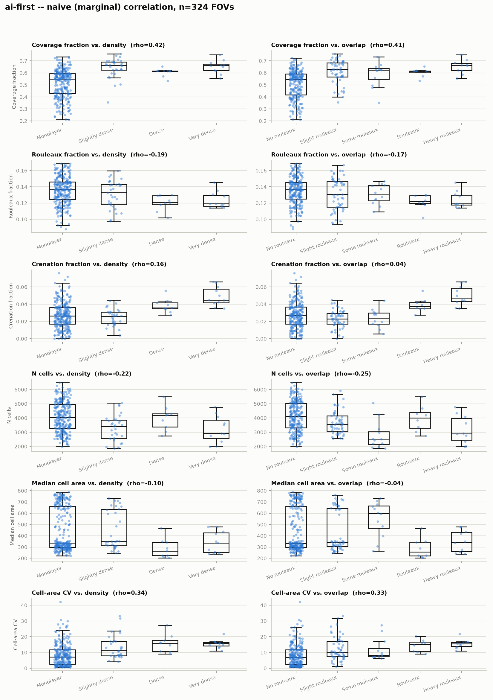
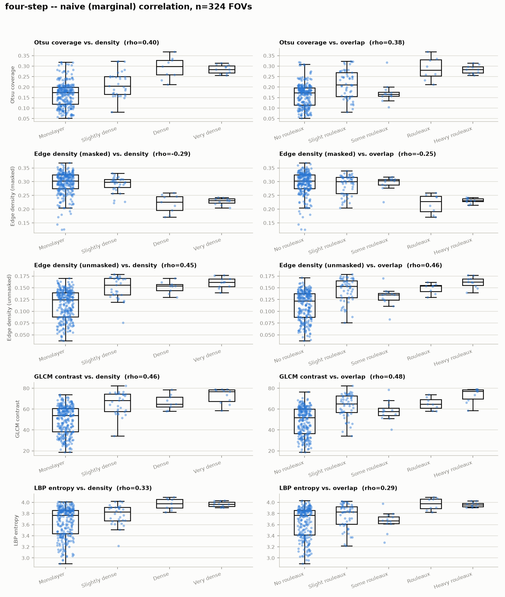
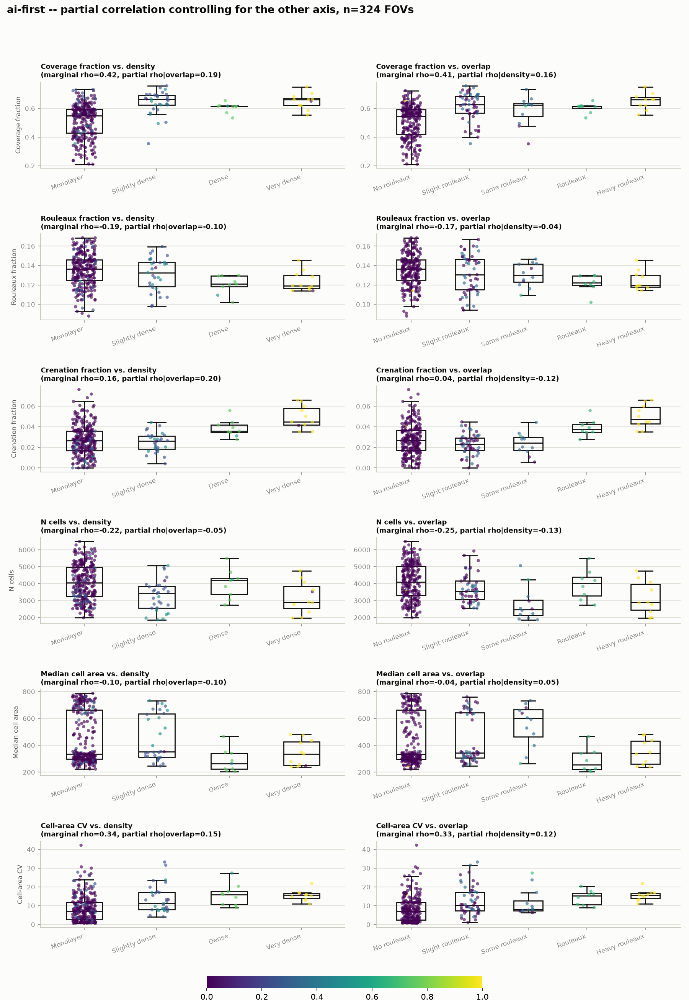
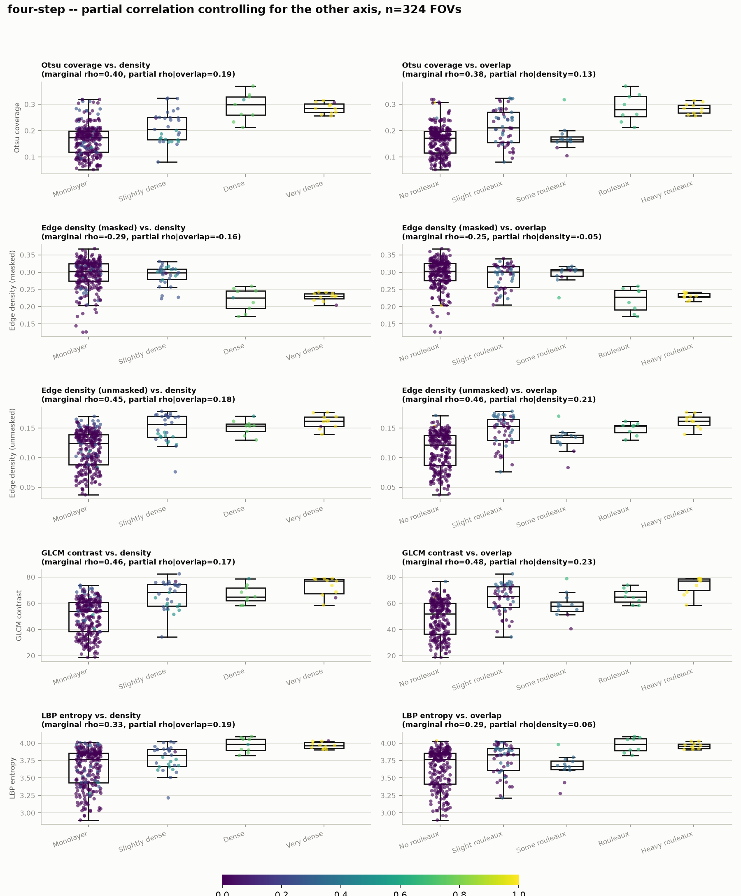

# Tanzania KTR-72502948: naive vs. partial correlation, two approaches

Dataset: all 324 FOVs from slide `KTR-72502948` (Tanzania), the same set used
in `data/results/tanzania-073026/analysis-073026.md`. Manual labels are
`data/labels/tanzania-073026/KTR-72502948-annotated.csv` (E. Chu). Produced by
`scripts/tanzania_comparison.py`.

Two approaches, each feature tested **separately** against density and
overlap (never blended into one combined severity score — that conflation is
why earlier analyses couldn't say which feature maps to which axis):

- **ai-first** — raw per-FOV metrics from `scripts/ai-first/score_new_slide.py`
  (`coverage_fraction`, `rouleaux_fraction`, `crenation_fraction`, `n_cells`,
  `median_area`, `area_cv`), already computed for this slide.
- **four-step** — the four `src/features/` techniques (Otsu coverage, edge
  density masked/unmasked, GLCM contrast, LBP entropy), run fresh over the
  same 324 images (`scripts/four-step/run_four_step_tanzania.py`).

For each feature x {density, overlap}: a **naive** (marginal) Spearman rho,
and a **partial** Spearman rho controlling for the other axis, since density
and overlap are themselves strongly correlated in this slide's manual labels
(**rho = 0.747**, n=324 — see `manual-annotation-distribution.png` for how
skewed both axes are: 273/324 monolayer, 241/324 no rouleaux). Partial
correlation uses the standard 3-variable formula on Spearman rhos:
`rho_xy.z = (rho_xy - rho_xz*rho_yz) / sqrt((1-rho_xz^2)(1-rho_yz^2))`.

## Files

- `manual-annotation-distribution.png` — the 324 manual density/overlap labels this
  whole analysis is checked against.
- `ai-first-naive.png`, `ai-first-partial.png` — ai-first pipeline, 6 features x 2 axes.
- `four-step-naive.png`, `four-step-partial.png` — four-step pipeline, 5 features x 2 axes.
- `correlation-summary.csv` — every marginal/partial rho, both approaches.

## Naive result: nearly every feature "looks like" it tracks both axes equally

Marginal rho with density and marginal rho with overlap are nearly identical
for almost every feature — e.g. GLCM contrast (0.46 density / 0.48 overlap),
Otsu/ai-first coverage (0.40-0.42 both axes), LBP entropy (0.33 / 0.29). That
is exactly the confound signature: a feature that tracks general crowding
severity will correlate with *both* labels just because the labels correlate
with each other (rho=0.75), regardless of whether the feature actually
encodes density, overlap, or neither specifically. Naive correlation alone
cannot distinguish these — which is the whole reason this repo has never
been able to say which technique maps to which scale.

## Partial result: signal shrinks a lot, but a few axis-specific patterns survive

Once the shared confound is removed, partial rhos drop to roughly 0.05-0.23
across the board (from marginal 0.16-0.48) — most of what looked like
per-feature signal was shared crowding-severity variance, not axis-specific
signal. A few things still stand out:

| Feature | Partial rho \| density | Partial rho \| overlap | Reading |
|---|---|---|---|
| `crenation_fraction` (ai-first) | **0.20** | **-0.12** | Density-specific; marginal overlap rho was already ~0 (0.04), and removing the confound makes it mildly *anti*-correlated with pure overlap. Cleanest single-axis signal in the set. |
| GLCM contrast (four-step) | 0.17 | **0.23** | Leans overlap-specific — the strongest partial-overlap signal found. |
| Edge density, unmasked (four-step) | 0.18 | 0.21 | Also leans overlap-specific, similar magnitude to GLCM contrast. |
| Otsu coverage / `coverage_fraction` | **0.19** | 0.13-0.16 | Leans density-specific — reassuring, since density is its intended semantics in both pipelines. |
| LBP entropy | **0.19** | 0.06 | Leans density-specific. |
| `rouleaux_fraction` (ai-first) | -0.10 | **-0.04** | Negative or ~zero on *both* axes, before and after deconfounding. This is the ai-first pipeline's dedicated overlap detector, and it shows no positive relationship with manual overlap at the raw-feature level — confirming, more precisely than the bucketed-label comparison in `analysis-073026.md` (rho=-0.19), that this technique needs to be replaced rather than recalibrated. |
| `median_area`, edge density (masked) | ~-0.1 to -0.16 | ~-0.05 to 0.05 | Weak/no signal on either axis. |

Taken together: coverage (either pipeline's version) and LBP entropy are the
best available density-leaning signals; GLCM contrast and unmasked edge
density are the best available overlap-leaning signals; crenation fraction is
incidentally density-specific rather than a distinct third axis. No feature
here cleanly isolates one axis with strong (>0.3) partial correlation — the
two manual axes may simply be too entangled, and/or these six-plus-five raw
features too coarse, to fully separate on this data alone.

## Caveats

- Single slide, single annotator — same caveat as `analysis-073026.md`. The
  confound estimate (rho=0.75) and every partial correlation above are
  specific to this slide's label distribution, which is heavily skewed
  (dense/very-dense and rouleaux/heavy-rouleaux each have only 8-11 FOVs).
  Tail-category estimates are correspondingly noisy.
- Partial correlation assumes a roughly linear (rank) relationship between
  density and overlap; the true relationship could be more complex (e.g.
  overlap only kicks in above some density threshold), which a single partial
  rho would not capture.
- This has not yet been cross-checked against the 13-FOV cross-slide set
  (`data/labels/initial-dataset-071626/fovs.csv`, rho(density,overlap)=0.95
  there — an even tighter confound on far fewer FOVs) — extending this same
  naive/partial analysis to that dataset, and pooling both, would show
  whether these axis-leanings are slide-specific or general.
