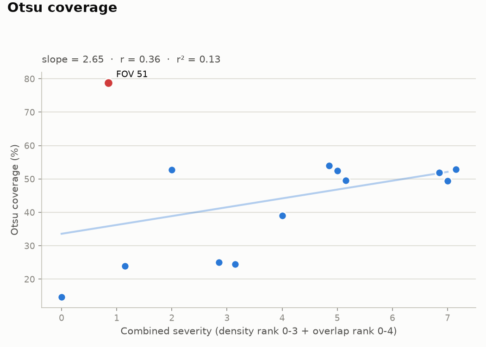
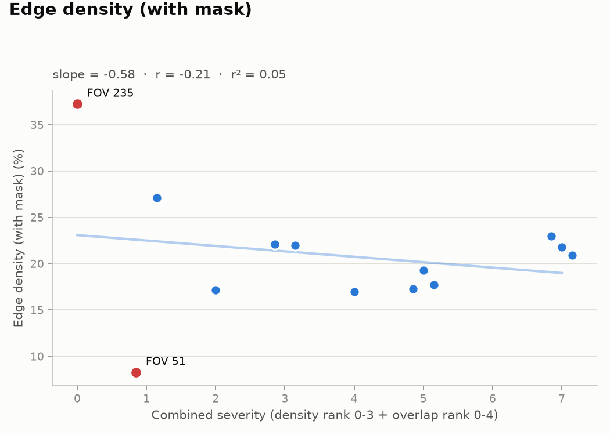
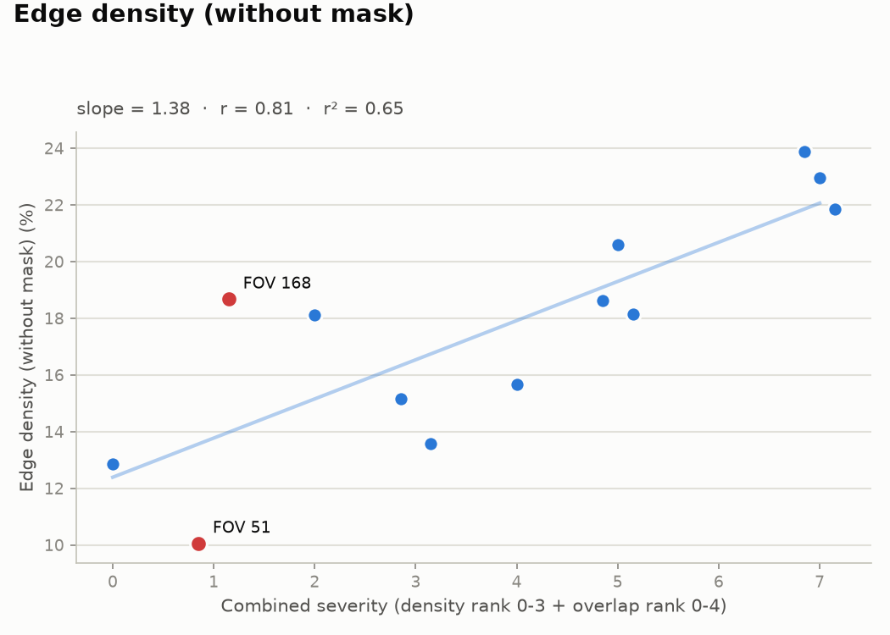
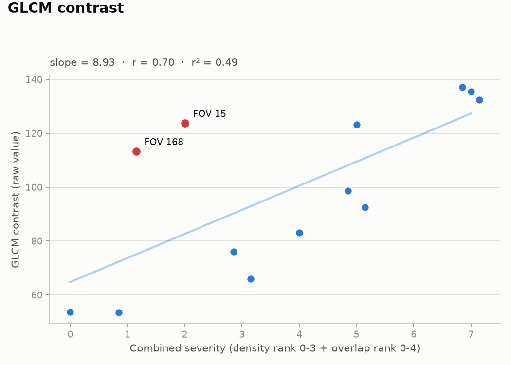
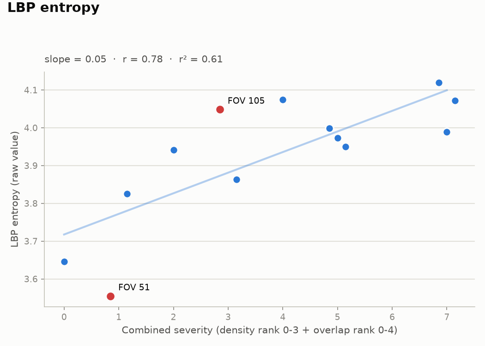

# Initial dataset: per-technique findings report

Dataset: `data/raw/initial-dataset-071626` (13 FOVs). Each technique's raw output is plotted against a combined ordinal severity score: density rank (monolayer=0, slightly dense=1, dense=2, very dense=3) plus overlap rank (no rouleaux=0, slight rouleaux=1, some rouleaux=2, rouleaux=3, heavy rouleaux=4), giving an integer range of 0-7. Points sharing a combined score are jittered horizontally for readability only -- the underlying x value is the integer score. Outliers are points whose residual from a per-technique linear fit exceeds 1.5 standard deviations.

## Otsu coverage

- Trend: value increases with combined severity (slope=2.65, r=0.36, r²=0.13, weak correlation).
- **Outliers** (|residual| > 1.5 sd from the linear trend): FOV 51 (dpc-051-LB-D3-2025-08-30-125645-25021889-D-thin-1.png, value=78.78, combined score=1, residual=42.54).

## Edge density (with mask)

- Trend: value decreases with combined severity (slope=-0.58, r=-0.21, r²=0.05, weak correlation).
- **Outliers** (|residual| > 1.5 sd from the linear trend): FOV 235 (dpc-235-KIT-62501048.png, value=37.24, combined score=0, residual=14.16); FOV 51 (dpc-051-LB-D3-2025-08-30-125645-25021889-D-thin-1.png, value=8.29, combined score=1, residual=-14.21).

## Edge density (without mask)

- Trend: value increases with combined severity (slope=1.38, r=0.81, r²=0.65, strong correlation).
- **Outliers** (|residual| > 1.5 sd from the linear trend): FOV 51 (dpc-051-LB-D3-2025-08-30-125645-25021889-D-thin-1.png, value=10.06, combined score=1, residual=-3.71); FOV 168 (dpc-168-KIT-62500666.png, value=18.68, combined score=1, residual=4.91).

## GLCM contrast

- Trend: value increases with combined severity (slope=8.93, r=0.70, r²=0.49, strong correlation).
- **Outliers** (|residual| > 1.5 sd from the linear trend): FOV 15 (dpc-015-LB-D3-2025-10-03-122127-250912792D-thin-3-4.png, value=123.83, combined score=2, residual=41.15, crenated); FOV 168 (dpc-168-KIT-62500666.png, value=113.39, combined score=1, residual=39.64).

## LBP entropy

- Trend: value increases with combined severity (slope=0.05, r=0.78, r²=0.61, strong correlation).
- **Outliers** (|residual| > 1.5 sd from the linear trend): FOV 105 (dpc-105-KIT-62500652.png, value=4.05, combined score=3, residual=0.17); FOV 51 (dpc-051-LB-D3-2025-08-30-125645-25021889-D-thin-1.png, value=3.55, combined score=1, residual=-0.22).

## Cross-technique outliers

FOVs flagged as outliers in more than one technique -- these disagree with their assigned density/overlap label across multiple independent signals, and are the best candidates for a manual visual re-check:

- **FOV 51**: outlier in Otsu coverage, Edge density (with mask), Edge density (without mask), LBP entropy
- **FOV 168**: outlier in Edge density (without mask), GLCM contrast