# Diverse overexposed FOVs test (2026-08-07)

Full run of the overexposure-detection pipeline (`src/overexposure.py`) against
`data/labels/overexposure-diverse-080726.csv` -- 76 rows, hand-picked to be visually diverse
"Overexposed"-tagged FOVs spanning all three labeled countries (51 Liberia, 15 Tanzania, 10
Uganda), each additionally labeled with ground truth on whether a genuine fluorescent spot is
present (independent of the overexposure look). Every FOV was streamed directly from GCS (no
local disk cache) via a new `src/gcs_fov_multi.py` resolver that extends the existing
Liberia-only `src/gcs_fov.py` to Tanzania (`gs://tanzania_02032026`) and Uganda
(`gs://malaria-annotation-web`).

## Input labels

| sample_id | fov_id | annotator | country | tags | spot | notes |
|---|---|---|---|---|---|---|
| LB-D10-2025-12-29-150312-0171084-VFPCHC-2-4 | 153 | A. Chen | Liberia | Overexposed | yes |  |
| LB-D10-2025-12-29-150312-0171084-VFPCHC-2-4 | 154 | A. Chen | Liberia | Slightly Dense, Rouleaux, Overexposed | yes |  |
| LB-D10-2025-12-30-083614-0250901VFPCHC-2-1 | 210 | A. Chen | Liberia | Overexposed | yes |  |
| LB-D10-2025-12-30-083614-0250901VFPCHC-2-1 | 227 | A. Chen | Liberia | Overexposed | yes |  |
| LB-D10-2025-12-30-084453-0250071VFPCHC-2-2 | 200 | A. Chen | Liberia | Rouleaux, Overexposed | yes |  |
| LB-D11-2025-12-17-115859-0250319D-thin-4-1 | 29 | A. Chen | Liberia | Overexposed | no | background |
| LB-D11-2025-12-19-111309-0211715-VFPCHC-3-1 | 277 | A. Chen | Liberia | Overexposed | yes | background |
| LB-D11-2025-12-19-131014-0241591-VFPCHC-3-2 | 278 | A. Chen | Liberia | Overexposed | yes | background |
| LB-D11-2025-12-19-134126-025073-VFPCHC-3-1 | 1 | A. Chen | Liberia | Overexposed | no | background |
| LB-D3-2025-08-30-103102-250876706-D-thin-4 | 257 | A. Chen | Liberia | Sparser, Crenated, Overexposed, Unfocused | no | background |
| LB-D3-2025-08-30-103102-250876706-D-thin-4 | 269 | A. Chen | Liberia | Sparser, Overexposed, Unfocused | no | background |
| LB-D3-2025-08-30-103102-250876706-D-thin-4 | 274 | A. Chen | Liberia | Sparser, Crenated, Overexposed | no | background |
| LB-D3-2025-08-30-103102-250876706-D-thin-4 | 279 | A. Chen | Liberia | Sparser, Crenated, Unfocused, Overexposed | no | background |
| LB-D3-2025-08-30-103102-250876706-D-thin-4 | 289 | A. Chen | Liberia | Sparser, Crenated, Overexposed, Unfocused | no | background |
| LB-D3-2025-09-02-141940-25087110-D-Only-1-2 | 42 | A. Chen | Liberia | Overexposed | yes | background |
| LB-D3-2025-09-09-093425-250917463-D-Only-1-1 | 166 | A. Chen | Liberia | Crenated, Overexposed | yes |  |
| LB-D3-2025-09-27-121918-17217958-D-thin-4-4 | 262 | A. Chen | Liberia | Overexposed | yes |  |
| LB-D3-2025-10-03-104211-250917371-D-thin-2-3 | 4 | A. Chen | Liberia | Overexposed, Unfocused | yes |  |
| LB-D3-2025-10-03-104643-250917465-D-thin-3-4 | 185 | A. Chen | Liberia | Overexposed | yes | green |
| LB-D3-2025-10-03-124025-2404175445D-thin-2-3 | 1 | A. Chen | Liberia | Crenated, Overexposed | no | background |
| LB-D3-2025-10-03-124025-2404175445D-thin-2-3 | 16 | A. Chen | Liberia | Crenated, Overexposed | no | background |
| LB-D3-2025-10-03-124025-2404175445D-thin-2-3 | 17 | A. Chen | Liberia | Crenated, Overexposed | no | background |
| LB-D3-2025-10-03-124025-2404175445D-thin-2-3 | 18 | A. Chen | Liberia | Crenated, Overexposed | no | background |
| LB-D3-2025-10-03-124025-2404175445D-thin-2-3 | 19 | A. Chen | Liberia | Crenated, Overexposed | no | background |
| LB-D3-2025-10-03-124025-2404175445D-thin-2-3 | 53 | A. Chen | Liberia | Crenated, Overexposed | no | background |
| LB-D3-2025-10-03-124025-2404175445D-thin-2-3 | 114 | A. Chen | Liberia | Overexposed | yes |  |
| LB-D3-2025-10-03-124025-2404175445D-thin-2-3 | 125 | A. Chen | Liberia | Crenated, Overexposed | yes |  |
| LB-D3-2025-10-03-124025-2404175445D-thin-2-3 | 126 | A. Chen | Liberia | Overexposed, Artifact | no | artifact |
| LB-D3-2025-10-03-125352-2402169466D-thin-2-1 | 3 | A. Chen | Liberia | Overexposed | yes | diffuse |
| LB-D3-2025-10-03-130859-250916865-D-thin-1-4 | 236 | A. Chen | Liberia | Overexposed | yes |  |
| LB-D3-2025-10-22-131729-250917745-D-thin-2-3 | 134 | A. Chen | Liberia | Overexposed | yes | double |
| LB-D3-2025-10-22-132316-2411189646-D-thin-1-4 | 135 | A. Chen | Liberia | Overexposed | yes | diffuse |
| LB-D3-2025-10-22-140622-250917738-D-thin-1-1 | 122 | A. Chen | Liberia | Overexposed | yes | double |
| LB-D3-2025-10-22-140622-250917738-D-thin-1-1 | 238 | A. Chen | Liberia | Overexposed | yes |  |
| LB-D3-2025-10-24-113736-250918214-D-thin-2-3 | 96 | A. Chen | Liberia | Overexposed | no* | relabeled by Emily 2026-08-07 (was yes) |
| LB-D3-2025-10-24-132012-25046898-D-thin-1-4 | 3 | A. Chen | Liberia | Overexposed | yes | diffuse |
| LB-D3-2025-10-24-132012-25046898-D-thin-1-4 | 305 | A. Chen | Liberia | Overexposed | yes |  |
| LB-D3-2025-10-24-162727-230918080-D-thin-1-4 | 8 | A. Chen | Liberia | Overexposed | yes | diffuse |
| LB-D3-2025-10-25-105806-180951467-D-thin-1-1 | 270 | A. Chen | Liberia | Overexposed | yes |  |
| LB-D3-2025-10-25-150947-250917467-D-thin-3-2 | 235 | A. Chen | Liberia | Overexposed | yes |  |
| LB-D3-2025-10-27-123159-251123404-D-thin-4-1 | 48 | A. Chen | Liberia | Overexposed | yes |  |
| LB-D3-2025-10-27-123159-251123404-D-thin-4-1 | 49 | A. Chen | Liberia | Overexposed | yes |  |
| LB-D3-2025-10-27-124239-250916732-D-thin-1-3 | 301 | A. Chen | Liberia | Overexposed | yes |  |
| LB-D3-2025-10-27-134711-250917368-D-thin-1-3 | 52 | A. Chen | Liberia | Overexposed | yes |  |
| LB-D3-2025-10-27-144635-250918691-D-thin-2-2 | 57 | A. Chen | Liberia | Overexposed, Large | no | artifact |
| LB-D3-2025-10-27-144635-250918691-D-thin-2-2 | 243 | A. Chen | Liberia | Unfocused, Overexposed | no | background |
| LB-D3-2025-10-27-145205-250917002-D-thin-3-3 | 310 | A. Chen | Liberia | Overexposed, Artifact | no | artifact |
| LB-D3-2025-10-27-154305-250917412-D-thin-1-4 | 119 | A. Chen | Liberia | Overexposed | yes | diffuse |
| LB-D3-2025-10-27-155920-250713919-D-thin-3-3 | 169 | A. Chen | Liberia | Overexposed | no | background |
| LB-D3-2025-10-27-173317-250917493-D-thin-2-4 | 82 | A. Chen | Liberia | Overexposed | yes |  |
| LB-D5-2026-01-27-112616-0240052-VFPCHC-2-2 | 40 | A. Chen | Liberia | Overexposed | no | background |
| KIT-62500763 | 200 | A. Chen | Tanzania | Overexposed | yes | green |
| KIT-62501035 | 67 | A. Chen | Tanzania | Overexposed | yes |  |
| KIT-62501062 | 83 | A. Chen | Tanzania | Overexposed | no | artifact |
| KIT-62501081 | 141 | A. Chen | Tanzania | Overexposed | yes | double |
| KIT-62501087 | 271 | A. Chen | Tanzania | Overexposed | yes |  |
| KTR-72502946 | 54 | E. Chu | Tanzania | Slightly Dense, Some Rouleaux, Overexposed | yes |  |
| KTR-72502946 | 198 | E. Chu | Tanzania | Dense, Some Rouleaux, Overexposed | yes |  |
| NKR-72502319 | 119 | A. Chen | Tanzania | Overexposed | no | background |
| NKR-72502319 | 293 | A. Chen | Tanzania | Overexposed | yes |  |
| NKR-72502319 | 311 | A. Chen | Tanzania | Overexposed | yes |  |
| RUB-62501332 | 133 | A. Chen | Tanzania | Overexposed | yes |  |
| RUB-62501389 | 284 | Z. Ahamad | Tanzania | Overexposed | yes | double |
| RUB-62501518 | 315 | A. Chen | Tanzania | Overexposed | no | background |
| RUB-62501529 | 87 | A. Ma | Tanzania | Overexposed | no | background |
| RUB-72501756 | 315 | A. Chen | Tanzania | Overexposed | yes |  |
| PAT-070-3 | 34 | A. Chen | Uganda | Overexposed | yes | double |
| PAT-072-1 | 14 | A. Chen | Uganda | Overexposed, Artifact | no | artifact |
| PAT-072-1 | 94 | A. Chen | Uganda | Sparser, Some Rouleaux, Overexposed, Artifact | no | artifact |
| PAT-154-1 | 478 | A. Chen | Uganda | Overexposed | no | background |
| PBC-225_AM-1 | 30 | A. Ma | Uganda | Sparser, Overexposed | no | background |
| PBC-608-KH-1 | 171 | A. Chen | Uganda | Overexposed | yes |  |
| PBC-800-1 | 128 | A. Ma | Uganda | Sparser, Deep Dimples, Overexposed, Medium | no | background |
| PBC-800-1 | 732 | A. Ma | Uganda | Deep Dimples, Overexposed | no | background |
| PAT-103-2 | 441 | E. Chu | Uganda | Overexposed | no | background |
| PAT-112-2 | 124 | E. Chu | Uganda | Overexposed | no | background |

`notes` is only partially filled in (background/artifact/diffuse/double/green on some rows,
blank on the rest) -- per Emily, the remaining rows still need categorizing. The subset
breakdowns below use only the rows currently tagged `background`/`diffuse`/`double`, so they
under-cover each category and will change as `notes` gets filled in further.

`*` fov=96 (`LB-D3-2025-10-24-113736-250918214-D-thin-2-3`) was originally labeled
`spot=yes`; Emily flagged it as mislabeled on 2026-08-07 after reviewing its preview (see
"FN/FP examples" -- it had shown up there as a false negative missed by both variants, but
looking at the actual image the ground truth itself was wrong, not the detector). Corrected to
`spot=no` in both `data/labels/overexposure-diverse-080726.csv` and `results.csv`; all
confusion matrices, rates, and the FN/FP example set below reflect the corrected label.

## Method and what "predicted" means here

Full per-row detection was run via `scripts/run_overexposed_diverse_test.py`, which streams
each FOV from GCS and calls the same production code path as `scripts/score_labels.py`:
`detect_overexposure()` (ratio gate -> anisotropy-fft fiber-debris demotion), plus the
advisory-only diffuse-fov step (`diffuse_candidate` -> neighbor-trend check ->
`diffuse_halo_flag`, fetching the 2 preceding fov_ids for context, same as
`scripts/scan_diffuse_candidates.py`).

**Important framing note (corrected 2026-08-07 -- an earlier draft of this doc had this
backwards).** In this dataset, "the fluorescent spot" and "the overexposed halo artifact" are
the same thing -- `spot` is ground truth on whether the overexposure artifact itself is
genuinely present, not a separate real-signal-vs-artifact distinction. So the predicted label
is `present` directly, with no inversion:

```
predicted_spot_present = present
```

A false negative is a real halo the ratio/anisotropy gate missed entirely (most importantly, a
faint/diffuse halo below `RATIO_THRESHOLD` -- exactly the case the diffuse-fov step was built
to catch). A false positive is an ordinary FOV -- elevated background from many puncta,
debris/hair, etc. -- that tripped the ratio gate without an actual halo present.

**"Folded in" vs. not.** `present_base` is exactly what production code returns today (diffuse
fields computed but never gating). `present_folded = present_base OR diffuse_halo_flag` --
i.e., what `present` (and therefore predicted spot) would become if the diffuse-fov step's
flag *were* wired into the decision, which it currently is not (see
`fluorescence/README.md`'s "Diffuse-halo signal" section for why).

## Per-FOV runtime

Streamed live from GCS, one FOV at a time, no disk cache. `neighbor_fetch_s` is only nonzero
for the 17 rows with `present_base=False` (whether from the ratio gate failing outright or an
anisotropy-based fiber/debris demotion -- see "Which FOVs flip" below) and a large-enough
diffuse footprint to trigger a neighbor-trend check (`diffuse_candidate`); it covers fetching + detecting on up to 2
preceding fov_ids for that check alone.

| sample_id | fov_id | country | gcs_fetch_s | initial_test_s | anisotropy_s | diffuse_fov_s | neighbor_fetch_s |
|---|---|---|---|---|---|---|---|
| LB-D10-2025-12-29-150312-0171084-VFPCHC-2-4 | 153 | Liberia | 14.0097 | 0.0512 | 0.0123 | 0.0022 | 0.0 |
| LB-D10-2025-12-29-150312-0171084-VFPCHC-2-4 | 154 | Liberia | 1.3379 | 0.0537 | 0.0212 | 0.0022 | 0.0 |
| LB-D10-2025-12-30-083614-0250901VFPCHC-2-1 | 210 | Liberia | 1.376 | 0.0567 | 0.0127 | 0.0021 | 0.0 |
| LB-D10-2025-12-30-083614-0250901VFPCHC-2-1 | 227 | Liberia | 1.2439 | 0.0527 | 0.0164 | 0.0027 | 0.0 |
| LB-D10-2025-12-30-084453-0250071VFPCHC-2-2 | 200 | Liberia | 1.5098 | 0.0592 | 0.0361 | 0.0023 | 0.0 |
| LB-D11-2025-12-17-115859-0250319D-thin-4-1 | 29 | Liberia | 1.9503 | 0.0558 | 0.0 | 0.0029 | 3.4523 |
| LB-D11-2025-12-19-111309-0211715-VFPCHC-3-1 | 277 | Liberia | 2.2825 | 0.0532 | 0.0 | 0.0021 | 3.3588 |
| LB-D11-2025-12-19-131014-0241591-VFPCHC-3-2 | 278 | Liberia | 1.8582 | 0.0565 | 0.0 | 0.0021 | 3.0643 |
| LB-D11-2025-12-19-134126-025073-VFPCHC-3-1 | 1 | Liberia | 1.6186 | 0.05 | 0.0 | 0.0023 | 0.0 |
| LB-D3-2025-08-30-103102-250876706-D-thin-4 | 257 | Liberia | 1.5743 | 0.0532 | 0.0154 | 0.0023 | 0.0 |
| LB-D3-2025-08-30-103102-250876706-D-thin-4 | 269 | Liberia | 1.3516 | 0.0558 | 0.0 | 0.0019 | 3.1276 |
| LB-D3-2025-08-30-103102-250876706-D-thin-4 | 274 | Liberia | 1.6508 | 0.0481 | 0.0068 | 0.0021 | 0.0 |
| LB-D3-2025-08-30-103102-250876706-D-thin-4 | 279 | Liberia | 1.4803 | 0.0503 | 0.0 | 0.0018 | 2.9643 |
| LB-D3-2025-08-30-103102-250876706-D-thin-4 | 289 | Liberia | 1.3793 | 0.0472 | 0.0319 | 0.0025 | 0.0 |
| LB-D3-2025-09-02-141940-25087110-D-Only-1-2 | 42 | Liberia | 3.9464 | 0.049 | 0.0161 | 0.0023 | 0.0 |
| LB-D3-2025-09-09-093425-250917463-D-Only-1-1 | 166 | Liberia | 2.2452 | 0.0497 | 0.0178 | 0.0022 | 0.0 |
| LB-D3-2025-09-27-121918-17217958-D-thin-4-4 | 262 | Liberia | 1.748 | 0.0485 | 0.0256 | 0.0028 | 0.0 |
| LB-D3-2025-10-03-104211-250917371-D-thin-2-3 | 4 | Liberia | 1.8197 | 0.0484 | 0.0224 | 0.0024 | 0.0 |
| LB-D3-2025-10-03-104643-250917465-D-thin-3-4 | 185 | Liberia | 1.6108 | 0.0516 | 0.014 | 0.0013 | 0.0 |
| LB-D3-2025-10-03-124025-2404175445D-thin-2-3 | 1 | Liberia | 1.5482 | 0.053 | 0.0 | 0.0019 | 0.0 |
| LB-D3-2025-10-03-124025-2404175445D-thin-2-3 | 16 | Liberia | 1.7044 | 0.0499 | 0.0 | 0.0018 | 0.0 |
| LB-D3-2025-10-03-124025-2404175445D-thin-2-3 | 17 | Liberia | 1.537 | 0.0468 | 0.0 | 0.0017 | 0.0 |
| LB-D3-2025-10-03-124025-2404175445D-thin-2-3 | 18 | Liberia | 1.4336 | 0.0889 | 0.0 | 0.0019 | 0.0 |
| LB-D3-2025-10-03-124025-2404175445D-thin-2-3 | 19 | Liberia | 1.3621 | 0.0574 | 0.0 | 0.0019 | 2.6905 |
| LB-D3-2025-10-03-124025-2404175445D-thin-2-3 | 53 | Liberia | 1.5994 | 0.0543 | 0.0 | 0.0017 | 3.1115 |
| LB-D3-2025-10-03-124025-2404175445D-thin-2-3 | 114 | Liberia | 1.603 | 0.0694 | 0.0497 | 0.0031 | 0.0 |
| LB-D3-2025-10-03-124025-2404175445D-thin-2-3 | 125 | Liberia | 1.7148 | 0.0584 | 0.0064 | 0.0016 | 0.0 |
| LB-D3-2025-10-03-124025-2404175445D-thin-2-3 | 126 | Liberia | 1.3878 | 0.0562 | 0.0078 | 0.0027 | 2.8854 |
| LB-D3-2025-10-03-125352-2402169466D-thin-2-1 | 3 | Liberia | 1.4922 | 0.0563 | 0.0115 | 0.0022 | 0.0 |
| LB-D3-2025-10-03-130859-250916865-D-thin-1-4 | 236 | Liberia | 1.461 | 0.0542 | 0.0214 | 0.0026 | 0.0 |
| LB-D3-2025-10-22-131729-250917745-D-thin-2-3 | 134 | Liberia | 2.0359 | 0.0556 | 0.0361 | 0.003 | 0.0 |
| LB-D3-2025-10-22-132316-2411189646-D-thin-1-4 | 135 | Liberia | 1.543 | 0.0635 | 0.0 | 0.0025 | 2.7661 |
| LB-D3-2025-10-22-140622-250917738-D-thin-1-1 | 122 | Liberia | 1.5306 | 0.0553 | 0.0 | 0.0025 | 3.2133 |
| LB-D3-2025-10-22-140622-250917738-D-thin-1-1 | 238 | Liberia | 1.9281 | 0.0515 | 0.0151 | 0.0024 | 0.0 |
| LB-D3-2025-10-24-113736-250918214-D-thin-2-3 | 96 | Liberia | 2.5637 | 0.0524 | 0.0 | 0.0011 | 0.0 |
| LB-D3-2025-10-24-132012-25046898-D-thin-1-4 | 3 | Liberia | 1.9472 | 0.0517 | 0.0 | 0.0021 | 3.8082 |
| LB-D3-2025-10-24-132012-25046898-D-thin-1-4 | 305 | Liberia | 1.9716 | 0.0508 | 0.014 | 0.0026 | 0.0 |
| LB-D3-2025-10-24-162727-230918080-D-thin-1-4 | 8 | Liberia | 1.8512 | 0.0493 | 0.0 | 0.0021 | 3.2547 |
| LB-D3-2025-10-25-105806-180951467-D-thin-1-1 | 270 | Liberia | 2.4905 | 0.0473 | 0.0101 | 0.0023 | 0.0 |
| LB-D3-2025-10-25-150947-250917467-D-thin-3-2 | 235 | Liberia | 1.9834 | 0.0503 | 0.0223 | 0.0027 | 0.0 |
| LB-D3-2025-10-27-123159-251123404-D-thin-4-1 | 48 | Liberia | 2.6114 | 0.0588 | 0.0207 | 0.0041 | 0.0 |
| LB-D3-2025-10-27-123159-251123404-D-thin-4-1 | 49 | Liberia | 1.8573 | 0.0506 | 0.0058 | 0.0025 | 0.0 |
| LB-D3-2025-10-27-124239-250916732-D-thin-1-3 | 301 | Liberia | 1.6959 | 0.0631 | 0.052 | 0.0028 | 0.0 |
| LB-D3-2025-10-27-134711-250917368-D-thin-1-3 | 52 | Liberia | 1.9126 | 0.0561 | 0.0263 | 0.0025 | 0.0 |
| LB-D3-2025-10-27-144635-250918691-D-thin-2-2 | 57 | Liberia | 1.9867 | 0.0534 | 0.006 | 0.0022 | 0.0 |
| LB-D3-2025-10-27-144635-250918691-D-thin-2-2 | 243 | Liberia | 1.8926 | 0.0611 | 0.0 | 0.001 | 0.0 |
| LB-D3-2025-10-27-145205-250917002-D-thin-3-3 | 310 | Liberia | 1.6342 | 0.0527 | 0.0029 | 0.0017 | 0.0 |
| LB-D3-2025-10-27-154305-250917412-D-thin-1-4 | 119 | Liberia | 1.6482 | 0.06 | 0.0 | 0.002 | 3.4071 |
| LB-D3-2025-10-27-155920-250713919-D-thin-3-3 | 169 | Liberia | 1.7499 | 0.0641 | 0.0 | 0.0011 | 0.0 |
| LB-D3-2025-10-27-173317-250917493-D-thin-2-4 | 82 | Liberia | 1.9329 | 0.0585 | 0.0186 | 0.0027 | 0.0 |
| LB-D5-2026-01-27-112616-0240052-VFPCHC-2-2 | 40 | Liberia | 2.787 | 0.0523 | 0.0 | 0.0018 | 3.6355 |
| KIT-62500763 | 200 | Tanzania | 24.8049 | 0.0332 | 0.0199 | 0.0028 | 0.0 |
| KIT-62501035 | 67 | Tanzania | 1.0191 | 0.033 | 0.0301 | 0.0029 | 0.0 |
| KIT-62501062 | 83 | Tanzania | 0.8403 | 0.0332 | 0.0 | 0.001 | 0.0 |
| KIT-62501081 | 141 | Tanzania | 1.0577 | 0.0357 | 0.0157 | 0.0022 | 0.0 |
| KIT-62501087 | 271 | Tanzania | 0.9844 | 0.0422 | 0.0167 | 0.0026 | 1.7317 |
| KTR-72502946 | 54 | Tanzania | 1.1398 | 0.0353 | 0.026 | 0.0023 | 0.0 |
| KTR-72502946 | 198 | Tanzania | 1.2847 | 0.0423 | 0.0469 | 0.0033 | 0.0 |
| NKR-72502319 | 119 | Tanzania | 1.0215 | 0.0365 | 0.0 | 0.001 | 0.0 |
| NKR-72502319 | 293 | Tanzania | 1.1657 | 0.0351 | 0.0166 | 0.0023 | 0.0 |
| NKR-72502319 | 311 | Tanzania | 1.207 | 0.0363 | 0.0131 | 0.0022 | 0.0 |
| RUB-62501332 | 133 | Tanzania | 1.3503 | 0.0425 | 0.0203 | 0.0024 | 0.0 |
| RUB-62501389 | 284 | Tanzania | 1.022 | 0.0364 | 0.0266 | 0.0023 | 0.0 |
| RUB-62501518 | 315 | Tanzania | 1.3214 | 0.041 | 0.0 | 0.001 | 0.0 |
| RUB-62501529 | 87 | Tanzania | 1.0089 | 0.0401 | 0.0 | 0.001 | 0.0 |
| RUB-72501756 | 315 | Tanzania | 1.1637 | 0.0469 | 0.024 | 0.0024 | 0.0 |
| PAT-070-3 | 34 | Uganda | 1.191 | 0.0488 | 0.0424 | 0.003 | 0.0 |
| PAT-072-1 | 14 | Uganda | 1.0437 | 0.0393 | 0.0068 | 0.0021 | 0.0 |
| PAT-072-1 | 94 | Uganda | 1.0505 | 0.0451 | 0.0497 | 0.0024 | 0.0 |
| PAT-154-1 | 478 | Uganda | 1.3411 | 0.0335 | 0.0 | 0.0009 | 0.0 |
| PBC-225_AM-1 | 30 | Uganda | 1.2138 | 0.037 | 0.0 | 0.001 | 0.0 |
| PBC-608-KH-1 | 171 | Uganda | 1.167 | 0.0356 | 0.0316 | 0.0029 | 0.0 |
| PBC-800-1 | 128 | Uganda | 1.2821 | 0.0342 | 0.0 | 0.0018 | 2.3308 |
| PBC-800-1 | 732 | Uganda | 1.1419 | 0.0416 | 0.0 | 0.002 | 2.545 |
| PAT-103-2 | 441 | Uganda | 1.2169 | 0.0331 | 0.0 | 0.001 | 0.0 |
| PAT-112-2 | 124 | Uganda | 1.1394 | 0.0406 | 0.0 | 0.0009 | 0.0 |

**Summary:**

| stage | min (s) | median (s) | max (s) | total (s) |
|---|---|---|---|---|
| gcs_fetch_s | 0.8403 | 1.5400 | 24.8049 | 156.5695 |
| time_initial_test_s | 0.0330 | 0.0504 | 0.0889 | 3.7525 |
| time_anisotropy_s | 0.0000 | 0.0089 | 0.0520 | 0.9618 |
| time_diffuse_fov_s | 0.0009 | 0.0022 | 0.0041 | 0.1630 |
| neighbor_fetch_s | 0.0000 | 0.0000 | 3.8082 | 51.3471 |

| country | n | median gcs_fetch_s | mean gcs_fetch_s |
|---|---|---|---|
| Liberia | 51 | 1.70 | 2.05 |
| Tanzania | 15 | 1.14 | 2.69 |
| Uganda | 10 | 1.18 | 1.18 |

Excluding the very first row of the run (14.0s, LB -- a one-time GCS client cold-start cost),
`gcs_fetch_s` ranges 0.84-24.8s with a median of 1.54s; the 24.8s Tanzania outlier (row 54,
`KIT-62500763`) is the first Tanzania row and looks like a second, box-listing-specific
cold-start rather than typical per-FOV cost (every subsequent Tanzania row is ~1s). **Neither
`gcs_fov.py` (Liberia) nor `gcs_fov_multi.py` (Tanzania/Uganda) caches slide/box lookups
across calls** -- every single fetch re-lists the Liberia `_Blue` folder and re-reads its
`Scan.txt`, or (for Tanzania) re-checks up to 5 `TZ2025-Box<N>` prefixes, even for FOVs from
the same scan/sample already resolved earlier in this same run. Uganda has no such lookup
(direct path), which is consistent with it having the lowest mean fetch time despite no
within-sample caching either. This isn't specific to this test -- it's how
`scripts/score_labels.py` and `scripts/fetch_reference_images.py` already behave -- but it
means per-FOV GCS time here is *not* representative of what a full-scan batch run would cost
per FOV if slide/box resolution were cached once per sample_id; that's a real optimization
opportunity if this pipeline is ever run at full-slide scale (see Recommendations).
`time_initial_test_s`/`time_anisotropy_s`/`time_diffuse_fov_s` are all local CPU work
(downsample/blur/threshold/FFT) and dominated entirely by network time -- consistent with the
prior diffuse-fov timing note ([[project-fluorescence-diffuse-halo-investigation]]: ~22ms/image
for the diffuse-fov step alone, matching `time_diffuse_fov_s`'s ~2-3ms here... actually smaller
here since that estimate included more overhead; treat both as "a few ms, negligible next to
network").

## Results: confusion matrices

Ground truth = `spot` column (is the halo artifact genuinely present). Predicted = `present`
directly (see "Method" above). All 4 matrices below are repeated for both variants.

### Diffuse-fov step NOT folded in (production behavior today)

**all** (n=76)

| | Predicted: spot | Predicted: no spot |
|---|---|---|
| Truth: spot | TP=36 | FN=8 |
| Truth: no spot | FP=5 | TN=27 |

FN rate: 8/44 (18.2%) -- FP rate: 5/32 (15.6%)

**background** (n=28)

| | Predicted: spot | Predicted: no spot |
|---|---|---|
| Truth: spot | TP=1 | FN=2 |
| Truth: no spot | FP=3 | TN=22 |

FN rate: 2/3 (66.7%) -- FP rate: 3/25 (12.0%)

**diffuse** (n=5)

| | Predicted: spot | Predicted: no spot |
|---|---|---|
| Truth: spot | TP=1 | FN=4 |
| Truth: no spot | FP=0 | TN=0 |

FN rate: 4/5 (80.0%) -- FP rate: n/a (no spot-negative rows in this subset)

**double** (n=5)

| | Predicted: spot | Predicted: no spot |
|---|---|---|
| Truth: spot | TP=4 | FN=1 |
| Truth: no spot | FP=0 | TN=0 |

FN rate: 1/5 (20.0%) -- FP rate: n/a (no spot-negative rows in this subset)

### Diffuse-fov step folded in (`present_folded = present_base OR diffuse_halo_flag`)

**all** (n=76)

| | Predicted: spot | Predicted: no spot |
|---|---|---|
| Truth: spot | TP=43 | FN=1 |
| Truth: no spot | FP=12 | TN=20 |

FN rate: 1/44 (2.3%) -- FP rate: 12/32 (37.5%)

**background** (n=28)

| | Predicted: spot | Predicted: no spot |
|---|---|---|
| Truth: spot | TP=3 | FN=0 |
| Truth: no spot | FP=9 | TN=16 |

FN rate: 0/3 (0.0%) -- FP rate: 9/25 (36.0%)

**diffuse** (n=5)

| | Predicted: spot | Predicted: no spot |
|---|---|---|
| Truth: spot | TP=4 | FN=1 |
| Truth: no spot | FP=0 | TN=0 |

FN rate: 1/5 (20.0%) -- FP rate: n/a (no spot-negative rows in this subset)

**double** (n=5)

| | Predicted: spot | Predicted: no spot |
|---|---|---|
| Truth: spot | TP=5 | FN=0 |
| Truth: no spot | FP=0 | TN=0 |

FN rate: 0/5 (0.0%) -- FP rate: n/a (no spot-negative rows in this subset)

## Discussion

**Folding in the diffuse-fov step is a real recall/specificity tradeoff: it rescues most of
the faint halos the ratio gate misses, at the cost of new false positives on ordinary
elevated-background FOVs (and, in one case, on a correctly-demoted debris artifact; in
another, it accidentally corrects an unrelated anisotropy-filter misfire on a genuine
high-ratio halo -- see "Which FOVs flip" below for both).** 17 of 76 rows had
`present_base=False` with a large enough
diffuse footprint to trigger the neighbor-trend check; 14 were flagged as isolated diffuse
halos (didn't match a neighbor's trend) and flipped from `present=False` to `present=True`
under fold-in:

| notes category | spot_truth=yes flips (helps -- rescues a missed halo) | spot_truth=no flips (hurts -- new false positive) |
|---|---|---|
| background | 2 | 6 |
| artifact | 0 | 1 |
| diffuse | 3 | 0 |
| double | 1 | 0 |
| (blank) | 1 | 0 |
| **total** | **7** | **7** |

Overall: FN rate drops from 18.2% to 2.3% (missing 8 real halos -> missing 1), while FP rate
more than doubles, 15.6% to 37.5% (5 false positives -> 12). The gains land almost entirely on
the cases the step was built for -- **all 3 ratio-failing `diffuse`-tagged real halos and the
1 `double`-tagged one get correctly rescued** (`diffuse` subset recall 1/5 -> 4/5, `double`
5/5 -> 5/5 with the pre-existing FN also caught). The cost lands almost entirely on
`background`-tagged FOVs: 6 of the 7 new false positives are rows annotated `background`
(ordinary elevated illumination from puncta/staining, not a real halo), pushing that subset's
FP rate from 12.0% to 36.0%. This lines up with a risk `src/overexposure.py`'s own module
docstring already calls out for the *ratio* gate's design ("a plain brightness-delta threshold
produced false positives on FOVs that were simply uniformly brighter overall... without an
actual halo") -- `DIFFUSE_ABS_DELTA` is exactly that kind of absolute-delta threshold, applied
without the ratio gate's normalization, so it's plausible this is the same failure mode
resurfacing in the diffuse-fov step specifically.

Two rows also relied on Tanzania/Uganda cross-country data for the diffuse check for the first
time (`KIT-62501087` fov=271, `PBC-800-1` fov=732) -- the diffuse-fov constants
(`DIFFUSE_RADIUS_MIN`, `NEIGHBOR_CENTROID_MATCH_DIST`, `NEIGHBOR_RADIUS_MATCH_FACTOR`) were
calibrated only on Liberia FOVs, so these two flips are a first (informal) look at whether
that calibration transfers, not a validation of it. (`KIT-62501087` was a `spot_truth=yes`
rescue; `PBC-800-1` fov=732 was a `background`-tagged false positive.) `KIT-62501087`'s rescue
is also the one case in the "helps" column that isn't really the diffuse-fov step doing its
intended job -- see "Which FOVs flip" below for why.

**Baseline performance is already reasonably good** (FN 18.2%, FP 15.6% overall) for a
detector whose ratio/anisotropy design predates this specific labeled test set. `diffuse` is
the weakest baseline subset (FN 80.0%) precisely because it's defined as the faint/sub-ratio
population the diffuse-fov step targets -- which is exactly why folding it in helps there so
much.

## Which FOVs flip if diffuse-fov is folded in

All 14 rows where `present_base != present_folded` -- i.e. every FOV the diffuse-fov step's
flag would actually change if it were wired into the decision (`present` only ever moves
False->True here; folding in never turns an already-True `present` back off). These are
exactly buckets A and D from the Discussion/FN-FP-examples sections above, just listed flat
and sorted so every affected FOV is visible at a glance. 7 of 14 are correct rescues, 7 of 14
are new false positives.

| sample_id | fov_id | country | spot_truth | notes | contrast_ratio | diffuse_radius | outcome | preview |
|---|---|---|---|---|---|---|---|---|
| LB-D11-2025-12-19-134126-025073-VFPCHC-3-1 | 1 | Liberia | no | background | 1.36 | 162.6 | new FP (was TN) | [link](previews/LB-D11-2025-12-19-134126-025073-VFPCHC-3-1__fov1__preview.png) |
| LB-D3-2025-08-30-103102-250876706-D-thin-4 | 269 | Liberia | no | background | 2.15 | 82.3 | new FP (was TN) | [link](previews/LB-D3-2025-08-30-103102-250876706-D-thin-4__fov269__preview.png) |
| LB-D3-2025-10-03-124025-2404175445D-thin-2-3 | 1 | Liberia | no | background | 1.92 | 67.8 | new FP (was TN) | [link](previews/LB-D3-2025-10-03-124025-2404175445D-thin-2-3__fov1__preview.png) |
| LB-D3-2025-10-03-124025-2404175445D-thin-2-3 | 19 | Liberia | no | background | 2.21 | 98.0 | new FP (was TN) | [link](previews/LB-D3-2025-10-03-124025-2404175445D-thin-2-3__fov19__preview.png) |
| LB-D3-2025-10-03-124025-2404175445D-thin-2-3 | 53 | Liberia | no | background | 2.05 | 78.3 | new FP (was TN) | [link](previews/LB-D3-2025-10-03-124025-2404175445D-thin-2-3__fov53__preview.png) |
| LB-D3-2025-10-03-124025-2404175445D-thin-2-3 | 126 | Liberia | no | artifact | 13.39 | 103.5 | new FP (was TN) | [link](previews/LB-D3-2025-10-03-124025-2404175445D-thin-2-3__fov126__preview.png) |
| PBC-800-1 | 732 | Uganda | no | background | 2.13 | 94.0 | new FP (was TN) | [link](previews/PBC-800-1__fov732__preview.png) |
| KIT-62501087 | 271 | Tanzania | yes | (none) | 14.27 | 152.8 | rescued (was FN) | [link](previews/KIT-62501087__fov271__preview.png) |
| LB-D11-2025-12-19-111309-0211715-VFPCHC-3-1 | 277 | Liberia | yes | background | 2.75 | 176.2 | rescued (was FN) | [link](previews/LB-D11-2025-12-19-111309-0211715-VFPCHC-3-1__fov277__preview.png) |
| LB-D11-2025-12-19-131014-0241591-VFPCHC-3-2 | 278 | Liberia | yes | background | 2.43 | 161.9 | rescued (was FN) | [link](previews/LB-D11-2025-12-19-131014-0241591-VFPCHC-3-2__fov278__preview.png) |
| LB-D3-2025-10-22-132316-2411189646-D-thin-1-4 | 135 | Liberia | yes | diffuse | 2.59 | 155.7 | rescued (was FN) | [link](previews/LB-D3-2025-10-22-132316-2411189646-D-thin-1-4__fov135__preview.png) |
| LB-D3-2025-10-22-140622-250917738-D-thin-1-1 | 122 | Liberia | yes | double | 2.75 | 205.7 | rescued (was FN) | [link](previews/LB-D3-2025-10-22-140622-250917738-D-thin-1-1__fov122__preview.png) |
| LB-D3-2025-10-24-132012-25046898-D-thin-1-4 | 3 | Liberia | yes | diffuse | 2.45 | 129.4 | rescued (was FN) | [link](previews/LB-D3-2025-10-24-132012-25046898-D-thin-1-4__fov3__preview.png) |
| LB-D3-2025-10-27-154305-250917412-D-thin-1-4 | 119 | Liberia | yes | diffuse | 2.91 | 84.9 | rescued (was FN) | [link](previews/LB-D3-2025-10-27-154305-250917412-D-thin-1-4__fov119__preview.png) |

Notice the "rescued" cases skew toward `diffuse`/`double`-tagged real halos and higher
`diffuse_radius` (85-206px), while every "new FP" case is `background`/`artifact`-tagged. The
6 `background`-tagged rescues/new-FPs together span `diffuse_radius` 67.8-176.2px with no
clean separation by `spot_truth`, which is the same "one gap, both classes fall in it" problem
the diffuse-halo investigation flagged from the start.

**`fov126` is flipping for a different reason than the other 13 rows -- worth flagging
separately.** Its `contrast_ratio=13.39` clears `RATIO_THRESHOLD=3.0` easily, so it isn't a
ratio-gate miss at all; `results.csv` shows `anisotropy=0.5588`, above
`ANISOTROPY_THRESHOLD=0.35`, so this candidate was correctly demoted to `present=False` by the
fiber/hair-debris check (consistent with its `artifact` note) -- and *that's* what made it
eligible for `diffuse_candidate()` (which only requires `present=False`, for any reason, not
specifically a ratio-gate miss). Folding in the diffuse-fov step then flipped it back to
`present=True`, undoing a demotion that looks correct. So the diffuse-fov step doesn't only
compete with the ratio gate on faint halos -- it can also override the anisotropy-based
fiber/debris filter, and here it did so incorrectly. This is a distinct failure mode from the
"background elevation" false positives above and worth calling out in any future recalibration
of `DIFFUSE_ABS_DELTA`/`DIFFUSE_RADIUS_MIN`.

**`KIT-62501087` fov=271 is the mirror-image case: a real halo mis-demoted by the anisotropy
filter, not a faint halo missed by the ratio gate.** Its `contrast_ratio=14.27` clears
`RATIO_THRESHOLD=3.0` easily -- this was never a sub-threshold candidate. `results.csv` shows
`anisotropy=0.4602`, above `ANISOTROPY_THRESHOLD=0.35`, so the ratio gate's initial "yes, halo
present" call got overturned by the fiber/hair-debris check, which mistook this halo's texture
for debris. Looking at its preview (`previews/KIT-62501087__fov271__preview.png`), it's a
clean, sharply-defined, corner-clipped circular halo -- plausibly the corner-clipping itself
biased the FFT-based anisotropy measurement toward the two frame-edge axes, mimicking the
directional-energy signature the check is designed to catch in actual fibers. It's also the
first Tanzania FOV in this test where the anisotropy value crossed `ANISOTROPY_THRESHOLD` at
all, and that threshold was calibrated exclusively on one Liberia slide's real-halo-vs-hair
examples (see `src/overexposure.py`'s docstring) -- so this could equally be a genuine
cross-country calibration gap rather than specifically a corner-clipping artifact. Either way,
the diffuse-fov step's fold-in flip here isn't rescuing a faint halo (its intended job); it's
incidentally undoing an unrelated anisotropy misfire.

## FN/FP examples

Annotated previews for all 20 rows that are a false negative or false positive in either variant, grouped into the same 4 buckets as the Discussion above. Red outline = `present` (this variant's detector call fired); green = did not fire. Caption lines show truth/notes, both variants' `present`, contrast ratio, and diffuse radius.

### A -- rescued by folding in (spot_truth=yes, missed at baseline, caught after fold-in) (n=7)

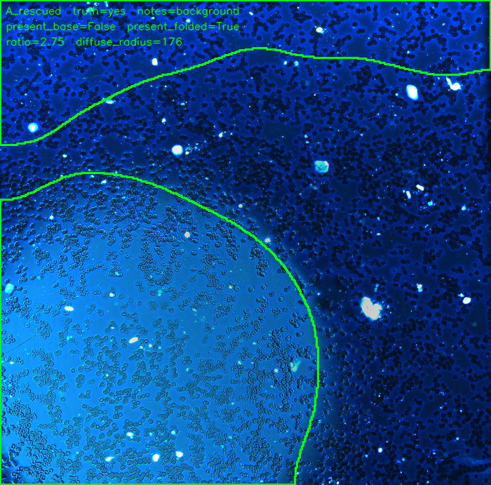
*LB-D11-2025-12-19-111309-0211715-VFPCHC-3-1 fov=277 (Liberia) -- truth=yes, notes=background, ratio=2.75*

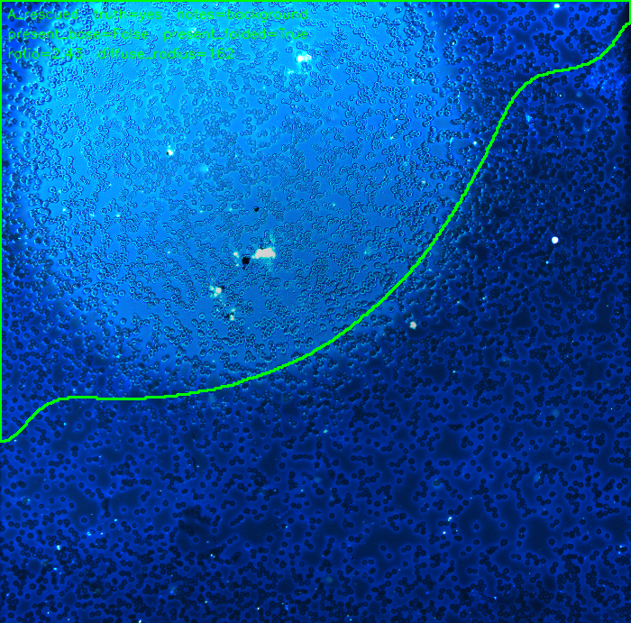
*LB-D11-2025-12-19-131014-0241591-VFPCHC-3-2 fov=278 (Liberia) -- truth=yes, notes=background, ratio=2.43*

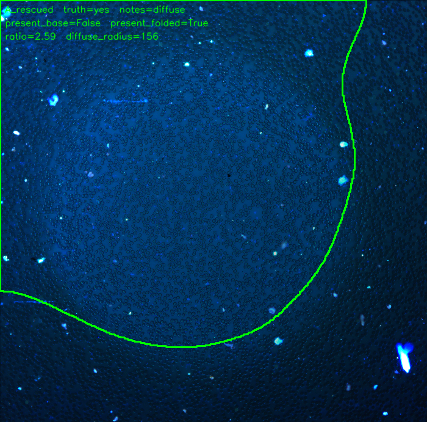
*LB-D3-2025-10-22-132316-2411189646-D-thin-1-4 fov=135 (Liberia) -- truth=yes, notes=diffuse, ratio=2.59*

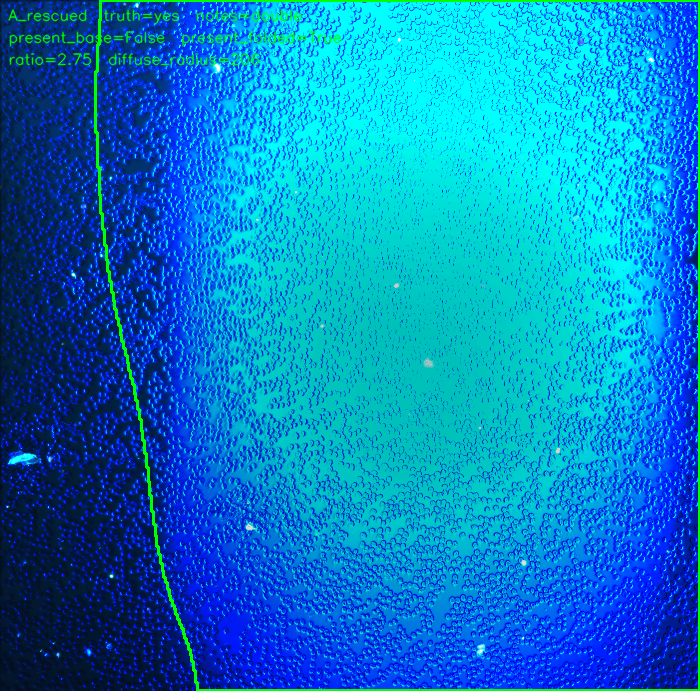
*LB-D3-2025-10-22-140622-250917738-D-thin-1-1 fov=122 (Liberia) -- truth=yes, notes=double, ratio=2.75*

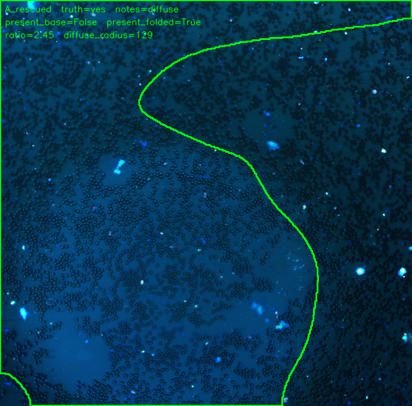
*LB-D3-2025-10-24-132012-25046898-D-thin-1-4 fov=3 (Liberia) -- truth=yes, notes=diffuse, ratio=2.45*

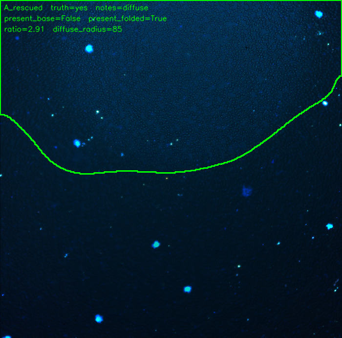
*LB-D3-2025-10-27-154305-250917412-D-thin-1-4 fov=119 (Liberia) -- truth=yes, notes=diffuse, ratio=2.91*

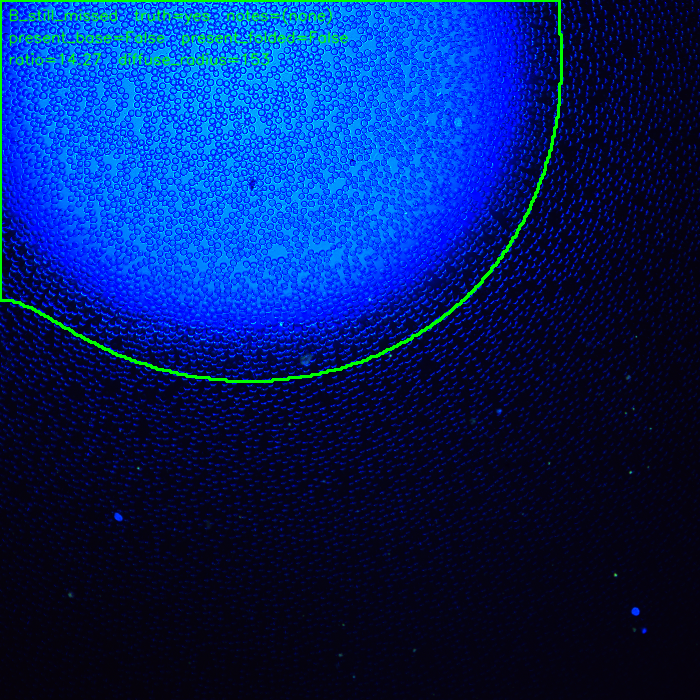
*KIT-62501087 fov=271 (Tanzania) -- truth=yes, notes=(none), ratio=14.27*

### B -- still missed after folding in (spot_truth=yes, missed by both variants) (n=1)

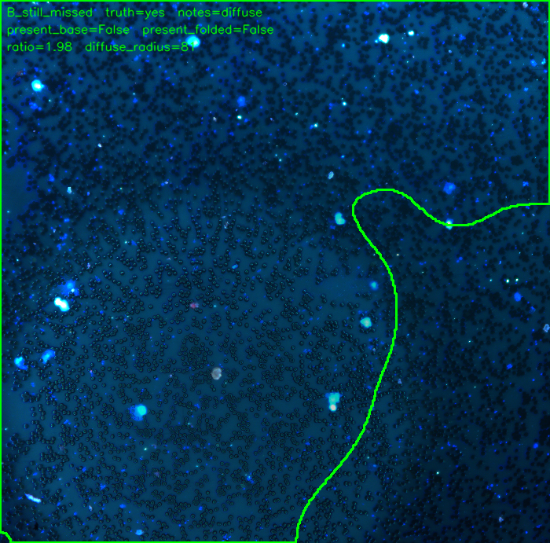
*LB-D3-2025-10-24-162727-230918080-D-thin-1-4 fov=8 (Liberia) -- truth=yes, notes=diffuse, ratio=1.98*

(fov=96, `LB-D3-2025-10-24-113736-250918214-D-thin-2-3`, was originally in this bucket but has
been removed after Emily flagged its `spot=yes` label as incorrect on 2026-08-07 -- see the
`*` footnote under "Input labels". With the corrected `spot=no` label it's a true negative in
both variants, not an error case.)

### C -- false positive already at baseline (spot_truth=no, present_base=True; folding in can't fix these, since it only ever turns present False->True) (n=5)

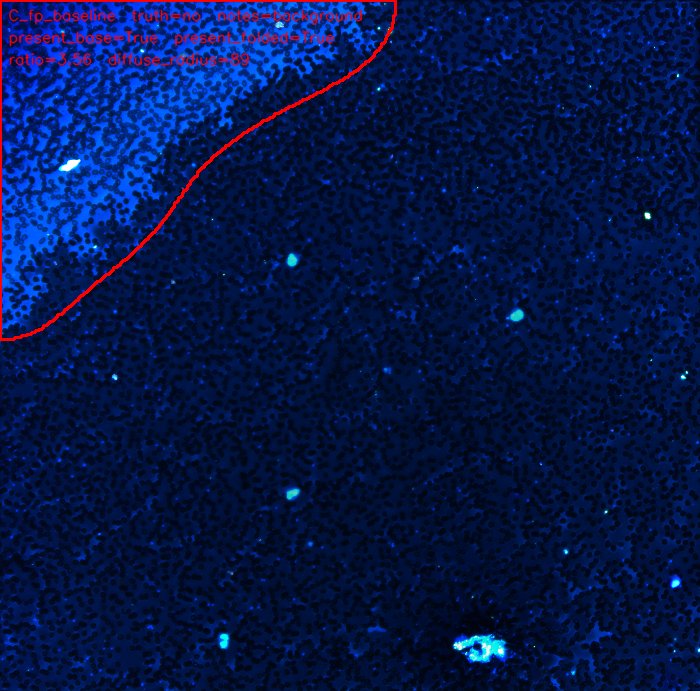
*LB-D3-2025-08-30-103102-250876706-D-thin-4 fov=257 (Liberia) -- truth=no, notes=background, ratio=3.56*

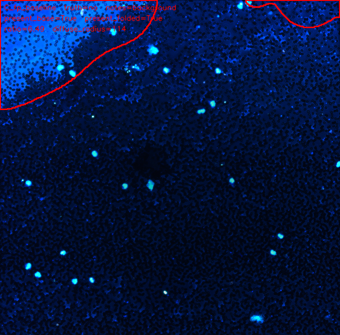
*LB-D3-2025-08-30-103102-250876706-D-thin-4 fov=274 (Liberia) -- truth=no, notes=background, ratio=6.49*

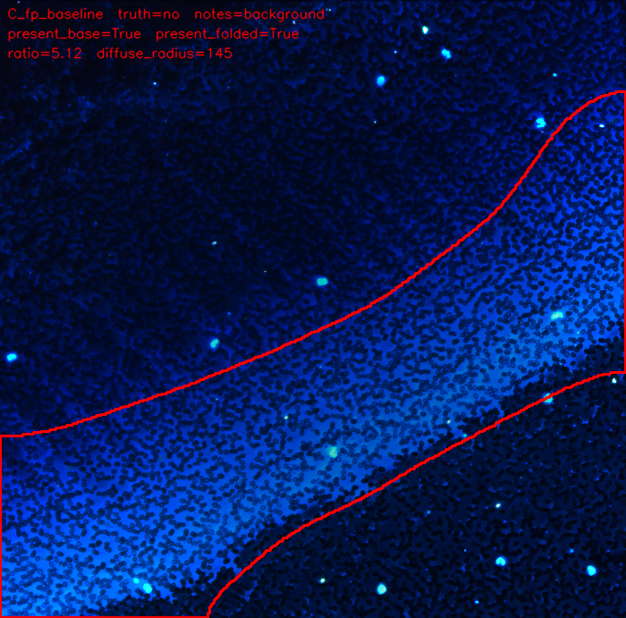
*LB-D3-2025-08-30-103102-250876706-D-thin-4 fov=289 (Liberia) -- truth=no, notes=background, ratio=5.12*

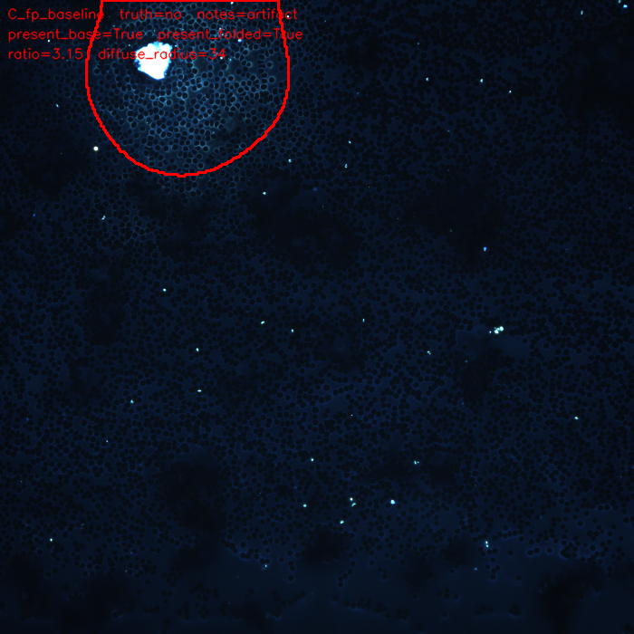
*PAT-072-1 fov=14 (Uganda) -- truth=no, notes=artifact, ratio=3.15*

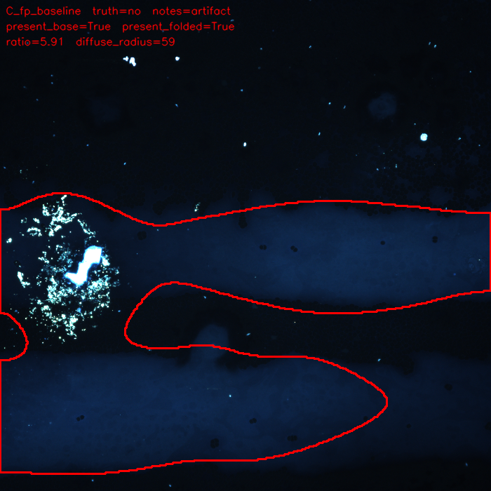
*PAT-072-1 fov=94 (Uganda) -- truth=no, notes=artifact, ratio=5.91*

### D -- new false positive introduced by folding in (spot_truth=no, only present_folded=True) (n=7)

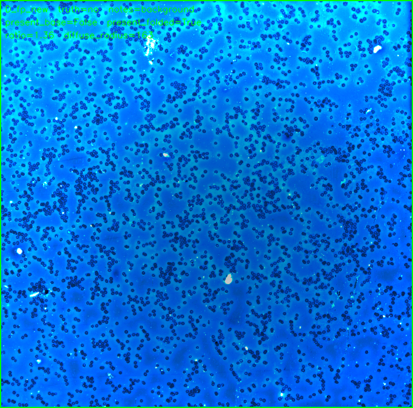
*LB-D11-2025-12-19-134126-025073-VFPCHC-3-1 fov=1 (Liberia) -- truth=no, notes=background, ratio=1.36*

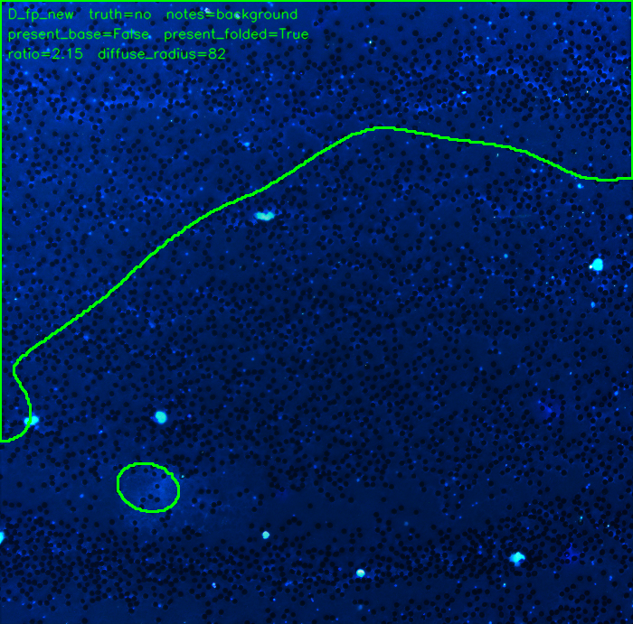
*LB-D3-2025-08-30-103102-250876706-D-thin-4 fov=269 (Liberia) -- truth=no, notes=background, ratio=2.15*

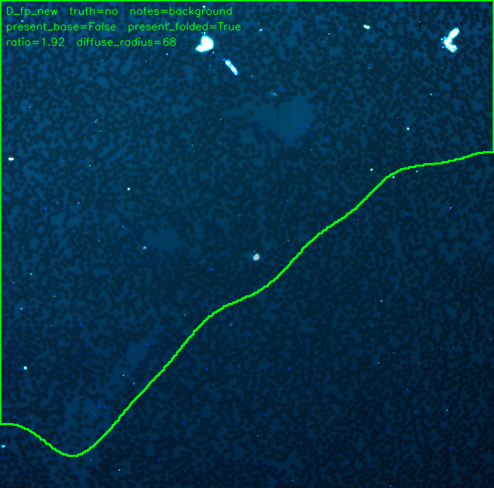
*LB-D3-2025-10-03-124025-2404175445D-thin-2-3 fov=1 (Liberia) -- truth=no, notes=background, ratio=1.92*

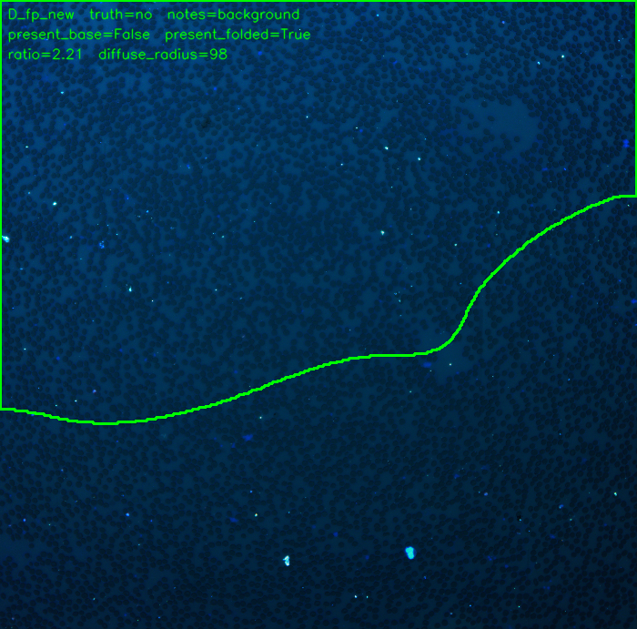
*LB-D3-2025-10-03-124025-2404175445D-thin-2-3 fov=19 (Liberia) -- truth=no, notes=background, ratio=2.21*

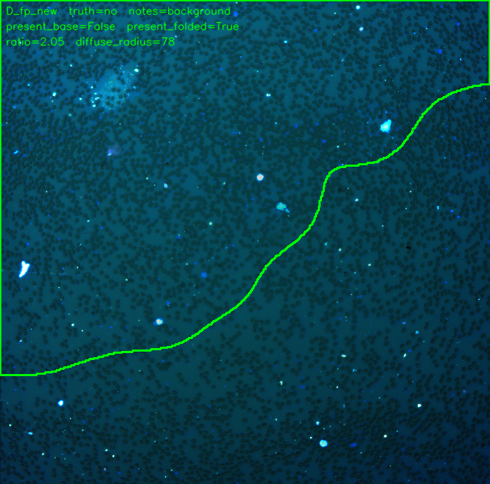
*LB-D3-2025-10-03-124025-2404175445D-thin-2-3 fov=53 (Liberia) -- truth=no, notes=background, ratio=2.05*

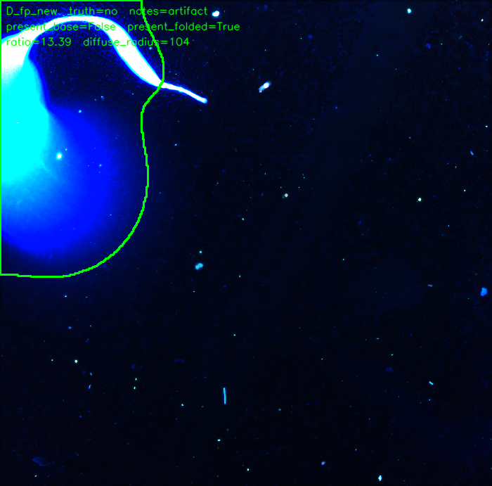
*LB-D3-2025-10-03-124025-2404175445D-thin-2-3 fov=126 (Liberia) -- truth=no, notes=artifact, ratio=13.39*

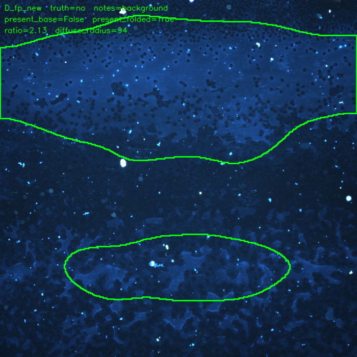
*PBC-800-1 fov=732 (Uganda) -- truth=no, notes=background, ratio=2.13*

## Caveats

- **Subset sizes are small.** `diffuse` and `double` are 5 rows each; a single-row flip shifts
  their FN/FP rate by 20 points. Treat the subset numbers as directional, not statistically
  robust, until `notes` is filled in further ([[project-fluorescence-diffuse-halo-investigation]]
  already flags the underlying diffuse-halo signal as calibrated on n=1 per class).
- **`notes` is incomplete.** Many rows (mostly straightforward, unambiguous cases) have no
  `notes` value and are excluded from every subset but `all`.
- **GCS per-FOV timings include repeated, uncached slide/box lookups** (see "Per-FOV runtime"
  above) -- don't use these numbers directly to estimate full-slide batch throughput.
- **This doc originally had the predicted/ground-truth polarity inverted** (comparing `NOT
  present` against `spot`, on the mistaken assumption that `spot` meant "genuine parasite
  signal independent of the overexposure artifact"). Corrected 2026-08-07 after Emily clarified
  that `spot` ground truth *is* ground truth on the halo artifact's presence. `results.csv`'s
  `predicted_spot_base`/`predicted_spot_folded` columns were patched in place to match
  (they're now identical to `present_base`/`present_folded`); no GCS data was re-fetched.

## Files

- `README.md` -- this file
- `results.csv` -- full per-row output: detection fields (`present_base`/`present_folded`/
  `diffuse_halo_flag`/`contrast_ratio`/`anisotropy`/`diffuse_radius`/etc.), both predicted-spot
  variants, and all runtime columns
- `previews/` -- annotated preview thumbnails for all 20 FN/FP rows (see "FN/FP examples"),
  plus `previews/manifest.csv` mapping each file back to its full result row and bucket
- `../../src/gcs_fov_multi.py` -- new LB/TZ/UG FOV resolver (streams, no disk cache)
- `../../scripts/run_overexposed_diverse_test.py` -- pipeline runner used for this test
- `../../scripts/analyze_overexposed_diverse.py` -- confusion-matrix/FN-FP tally generator
- `../../scripts/render_fn_fp_previews.py` -- renders the `previews/` thumbnails

## Recommendations

1. **Cache slide/box resolution per sample_id within a run** if this pipeline is ever run at
   full-slide or multi-scan batch scale -- `gcs_fov.py`/`gcs_fov_multi.py` currently re-resolve
   on every single fetch, which is fine for a 76-row spot-check but would add up across a full
   slide (hundreds of FOVs, often the same handful of samples repeated).
2. **Finish categorizing `notes`** so the background/diffuse/double (and any new categories)
   breakdowns cover the full dataset, not just the ~35 rows currently tagged.
3. **Consider folding the diffuse-fov step into `present`, but recalibrate `DIFFUSE_ABS_DELTA`
   first specifically against `background`-tagged (elevated-illumination, no-halo) FOVs** --
   this test is the first labeled evidence that it substantially improves recall on faint/
   diffuse real halos (the case it was built for), but more than doubles the false-positive
   rate, concentrated on exactly the ordinary-background-elevation failure mode the ratio gate
   was originally designed to avoid.
